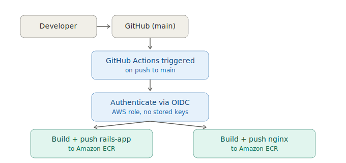
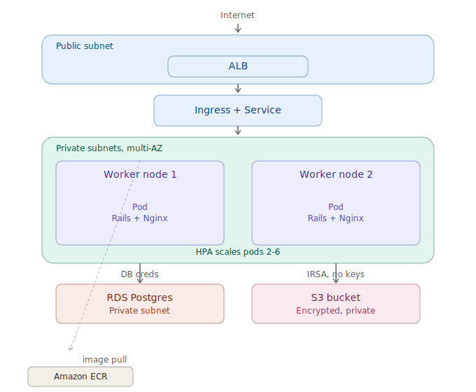

# Ruby on Rails on Amazon EKS — DevOps Assignment Submission

Infrastructure-as-code deployment of the provided Rails + Nginx application to
Amazon EKS, with a GitHub Actions CI/CD pipeline building Docker images to
Amazon ECR, RDS Postgres for the database, and S3 for application storage.

## CI/CD pipeline



```
Developer → GitHub (main) → GitHub Actions triggered
    → Authenticate via OIDC (no stored AWS keys)
    → Build + push rails-app image to ECR
    → Build + push nginx image to ECR
```

## Kubernetes / EKS architecture



```
Internet → ALB (public subnet)
    → Ingress + Service
    → EKS worker nodes (private subnets, multi-AZ)
        Pods: Rails + Nginx containers together, 2-6 replicas via HPA
          ├── RDS Postgres (private subnet, DB credentials via Secrets Manager)
          └── S3 bucket (IAM role via IRSA — no access keys)
    ← images pulled from Amazon ECR
```

## AWS services used

EC2 (EKS worker nodes), EKS, RDS (Postgres), S3, ALB, ECR, VPC/subnets/NAT
gateways, IAM (including IRSA and GitHub OIDC federation), Secrets Manager.

## Repository structure

```
docker/app/Dockerfile            # Rails container (provided, unedited)
docker/app/entrypoint.sh         # Rails entrypoint (provided, FIXED — see below)
docker/nginx/Dockerfile          # Nginx container (provided, unedited)
docker/nginx/default.conf        # Nginx config (provided, FIXED — see below)
docker-compose.yml               # Local dev only, not used in AWS deployment
.github/workflows/               # CI/CD pipeline (build → ECR)
infrastructure/terraform/        # All infrastructure as code
infrastructure/kubernetes/       # Kubernetes manifests
architecture-diagram.svg
```

## Fixes made to provided source files, and why

Two edits were made to files provided by the company. Both are small,
targeted, and documented here rather than silently changed.

### `docker/app/entrypoint.sh` — removed `db:schema:load`

The original entrypoint ran, on every container boot:
```sh
bundle exec rails db:create
bundle exec rails db:schema:load
bundle exec rails db:migrate
```
`db:schema:load` uses `force: :cascade` in the generated schema, meaning it
**drops and recreates every table on every run**. In a multi-replica EKS
deployment, every pod restart, rolling update, or HPA scale-out event would
have wiped the production database. `db:create` and `db:migrate` alone are
idempotent and safe to run on every boot; `db:schema:load` was removed.

### `docker/nginx/default.conf` — changed the upstream target

```nginx
upstream rails_app {
  server rails_app:3000;   →   server 127.0.0.1:3000;
}
```
The `rails_app` hostname only resolves inside a Docker Compose network,
where Compose runs its own internal DNS mapping service names to container
IPs. In this EKS deployment, the Rails and Nginx containers run **together
in one Kubernetes Pod**, sharing a single network namespace — there is no
Compose-style DNS inside a Pod, only `localhost`/`127.0.0.1`. The
`proxy_pass http://rails_app;` line elsewhere in the file was left
unchanged, since it refers to the `upstream` block's name, not a network
address.

## Other findings, not changed (documented only)

- **`docker-compose.yml`**: the `webserver` service maps `"8080:8080"`, but
  Nginx inside the container listens on port 80 (confirmed by
  `default.conf`'s `listen 80;` and the Nginx Dockerfile's `EXPOSE 80`).
  Locally, `docker-compose up` would need `"8080:80"` to actually work. This
  doesn't affect the AWS deployment, since Kubernetes talks to the container
  on port 80 directly, bypassing Compose entirely.
- **RDS engine version**: the assignment specifies Postgres 13.3, matching
  the local dev `docker-compose.yml` image tag. AWS has deprecated several
  13.x minor versions, including 13.3, for new RDS instances. The nearest
  currently available version was used instead (confirmed via
  `aws rds describe-db-engine-versions`), and is set in
  `infrastructure/terraform/terraform.tfvars`.
- **`RAILS_ENV`**: not in the README's required env var list, but added via
  the Kubernetes ConfigMap since the Dockerfile never sets it and Rails
  defaults to `development` otherwise, which is unsuitable for a public
  deployment (verbose error pages, no production caching).

## Environment variables

Matches the README's specification exactly, delivered via a Kubernetes
ConfigMap (non-sensitive) and Secret (credentials):

| Variable | Source |
|---|---|
| `RDS_DB_NAME`, `RDS_HOSTNAME`, `RDS_PORT`, `S3_BUCKET_NAME`, `S3_REGION_NAME`, `LB_ENDPOINT` | ConfigMap |
| `RDS_USERNAME`, `RDS_PASSWORD` | Secret, created directly from AWS Secrets Manager at deploy time — never written to a file or committed to git |
| `RAILS_ENV` | ConfigMap (addition, see above) |

Nginx container: no environment variables, matching the README's "NIL"
specification.

## Security decisions

- **S3 access via IRSA, not access keys**: the Rails pod's ServiceAccount is
  annotated with an IAM role ARN. EKS injects short-lived AWS credentials
  into the pod automatically; the `aws-sdk-s3` gem picks these up via the
  standard AWS SDK credential chain with no code changes and no static keys
  anywhere.
- **RDS access via database credentials**: a separate mechanism from S3 —
  connects over the network using host/username/password, gated by a
  security group that only allows connections from EKS worker nodes.
- **Least-privilege IAM**: the Rails app's IAM role is scoped to exactly one
  S3 bucket and one Secrets Manager secret — no wildcard permissions.
- **GitHub Actions authenticates to AWS via OIDC**, not stored access keys.
  GitHub's OIDC provider issues a short-lived token per workflow run; an IAM
  role trust policy validates the token's repository, branch, and (per
  GitHub's July 2026 immutable subject claim change) permanent owner/repo
  ID before granting temporary credentials scoped only to pushing images to
  the two ECR repositories.
- **All compute and the database are in private subnets**; only the ALB is
  public.
- **DB password** is generated by Terraform (`random_password`), stored only
  in AWS Secrets Manager, and pulled into the cluster via `kubectl create
  secret` at deploy time — never hardcoded, never committed.
- **State file hygiene**: `terraform.tfstate` and `.terraform/` are
  `.gitignore`d, since Terraform state contains the RDS password in
  plaintext.

## CI/CD pipeline

GitHub Actions (`.github/workflows/`) triggers on push to `main`:
1. Checkout
2. Authenticate to AWS via OIDC (no stored keys)
3. Log in to ECR
4. Build and push the `rails-app` image
5. Build and push the `nginx` image

Both images are tagged with the git commit SHA and `latest`.

## Scaling

- **Pod-level**: `HorizontalPodAutoscaler`, 2–6 replicas, scaling on 70% CPU
  utilization (requires `metrics-server`, installed via Helm).
- **Node-level**: EKS managed node group with `min`/`max` size configured in
  Terraform.

## Deployment steps

### Prerequisites
AWS account, `awscli`, `terraform` >= 1.5, `kubectl`, `helm`, `jq`.

### 1. Infrastructure
```bash
cd infrastructure/terraform
terraform init
terraform apply
```

### 2. CI/CD
Push to `main` — GitHub Actions builds and pushes both images to ECR
automatically. Confirm both images exist:
```bash
aws ecr describe-images --repository-name ror-app/rails-app
aws ecr describe-images --repository-name ror-app/nginx
```

### 3. Kubernetes
```bash
aws eks update-kubeconfig --region us-east-1 --name ror-app-eks
cd ../kubernetes

kubectl apply -f namespace.yml
kubectl apply -f serviceaccount.yml

kubectl create secret generic rails-app-secrets --namespace ror-app \
  --from-literal=RDS_USERNAME=$(aws secretsmanager get-secret-value \
      --secret-id ror-app/rds/credentials --query SecretString --output text | jq -r .username) \
  --from-literal=RDS_PASSWORD=$(aws secretsmanager get-secret-value \
      --secret-id ror-app/rds/credentials --query SecretString --output text | jq -r .password)

kubectl apply -f secrets.yml
kubectl apply -f deployment.yml
kubectl apply -f service.yml
kubectl apply -f ingress.yml

helm repo add metrics-server https://kubernetes-sigs.github.io/metrics-server/
helm install metrics-server metrics-server/metrics-server -n kube-system
kubectl apply -f hpa.yml
```

### 4. Get the app URL
```bash
kubectl get ingress rails-app-ingress -n ror-app
```
Update `LB_ENDPOINT` in the ConfigMap with the ALB DNS name shown, then:
```bash
kubectl rollout restart deployment rails-app -n ror-app
```

### 5. Verify
```bash
curl http://<alb-dns-name>/
```
